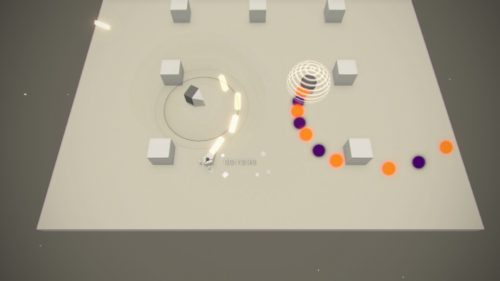
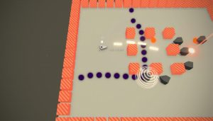

# hackingGameNier
Hacking mini game from NieR : Automata re-created with Unreal Engine for learning and fun purposes :) 

How to install :
- This game was build with Unreal Engine 4.14.3, so you should have at least this version.
- Once you cloned the project, either double click on  the HackingGameNier.uproject icon, or choose to browse to this file from the EpicGame/UnrealEngine Launcher
- Once the editor is launched, click on Maps folder, then double click on the GameMap file.
- There you go ! You can now play / edit this project to make it look like NieR Automata's Hacking mini game !

Here are a few examples of what I'm trying to achieve with this project :

Done : 

- (28/03/17) : Playable prototype on which the game will be build
- (29/03/17) : Camera now following the player (done with BP)
- (29/03/17) : Player Projectiles (material), 3 Life for the Player (C++ & GUI text Widget)

TODO (started 28/03/17) :

- ~~Change the camera and make it follow the player with Lerp (linear interpolation)~~ Done
- create different types of enemies (protected, turrets, following enemies)
- create new materials/textures/UI similar to the original game
- create obstacles (and obstacles that can damage the player)
- give 3hp to the player and different life points to the enemies depending their types
- Add multiple levels
- Change the assets for the player, enemies, obstacles and bullets/projectiles 

